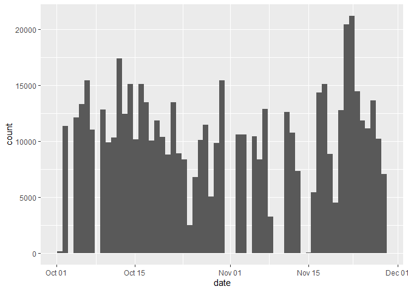
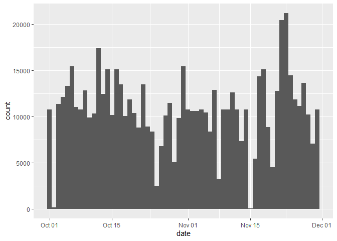
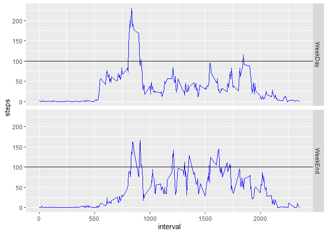

## Loading and preprocessing the data
The data comes in a zipped file, in the current working directory. let's unzip
it, load it, and see what it looks like.  
We'll setup the column types to fit the data in the file.

```r
unzip('activity.zip')
activity <- read.table('activity.csv', header=T, sep=',', colClasses = 
                         c("numeric", "Date", "numeric"))
str(activity)
```

```
## 'data.frame':	17568 obs. of  3 variables:
##  $ steps   : num  NA NA NA NA NA NA NA NA NA NA ...
##  $ date    : Date, format: "2012-10-01" "2012-10-01" ...
##  $ interval: num  0 5 10 15 20 25 30 35 40 45 ...
```


## What is mean total number of steps taken per day?
First let's load the libraries we need to use

```r
library(ggplot2)
library(dplyr)
```

Now let's see how many daily steps we have.

```r
dailySteps <- activity[!is.na(activity$steps),] %>%
  group_by(date) %>%
  summarise(steps=sum(steps))

ggplot(dailySteps, aes(x=date)) + 
  geom_histogram(aes(weight=steps), bins=length(unique(activity$date)))
```

<!-- -->

Mean and median daily steps: 

```r
print(paste('Mean:', as.character(mean(dailySteps$steps))))
```

```
## [1] "Mean: 10766.1886792453"
```

```r
print(paste('Median:', as.character(median(dailySteps$steps))))
```

```
## [1] "Median: 10765"
```

## What is the average daily activity pattern?
First let's re-summarise the data based on intervals.

```r
intervalMean <- activity[!is.na(activity$steps),] %>%
  group_by(interval) %>%
  summarise(steps=mean(steps), .groups='drop')
```
Now we can plot :-)

```r
ggplot(intervalMean, aes(x=interval, y=steps)) + 
  geom_line()
```

<!-- -->

## Imputing missing values
First, let's check how many missing values we have, and what percentage of the
samples it is:

```r
sum(is.na(activity$steps))
```

```
## [1] 2304
```

```r
mean(is.na(activity$steps))
```

```
## [1] 0.1311475
```

Now, we need to decide how to fill these missing values with imputed data.  
i've chosen to fill the data based on the daily pattern. i.e. use the mean value  
of the same interval across all days.
The reasoning is that I believe there is more variance across all intervals of  
the same day than there is across days in the same interval.  

We already have the interval mean from the previous plot. let's use it to get  
the mean values into the na locations

```r
activity$steps[is.na(activity$steps)] <- # insert into all NA values
  sapply(activity$interval[is.na(activity$steps)], # select interval of na values
         # return the mean value for each interval.
         function (x) { intervalMean[intervalMean$interval==x,'steps'] })

activity$steps <- unlist(activity$steps) # unlist after sapply
```
Now the values within the `activity` data frame are imputed. let's verify by looking  
at the number of missing values again (we expect 0)


```r
sum(is.na(activity$steps))
```

```
## [1] 0
```

Now that we've removed missing values, let's review the daily steps histogram,
mean, and median.

```r
dailySteps2 <- activity[!is.na(activity$steps),] %>%
  group_by(date) %>%
  summarise(steps=sum(steps))
```

```
## `summarise()` ungrouping output (override with `.groups` argument)
```

```r
ggplot(dailySteps2, aes(x=date)) + 
  geom_histogram(aes(weight=steps), bins=length(unique(activity$date)))
```

<!-- -->
Mean and median daily steps: 

```r
print(paste('Mean:', as.character(mean(dailySteps2$steps))))
```

```
## [1] "Mean: 10766.1886792453"
```

```r
print(paste('Median:', as.character(median(dailySteps2$steps))))
```

```
## [1] "Median: 10766.1886792453"
```
Looks like there is a very small difference in the median after completing the na
values. The mean looks pretty much the same.

## Are there differences in activity patterns between weekdays and weekends?
First, let's add a column to every sample that specifies if it is weekday or weekend.

```r
# function that returns true when weekend.
isWeekend <- function(x) {
  weekdays(x) %in% c("Sunday", "Saturday")
}
# add factor variable
activity$daytype <- factor(ifelse(isWeekend(activity$date), "WeekEnd", "WeekDay")) 
```
Next, we need to create a new mean variable grouped by our factor variable:

```r
meanByType <- activity %>%
  group_by(interval, daytype) %>%
  summarise(steps=mean(steps))
```

```
## `summarise()` regrouping output by 'interval' (override with `.groups` argument)
```
And now let's see the activity pattern per day type

```r
ggplot(meanByType, aes(x=interval, y=steps, group=daytype)) + 
       geom_line(color="blue") + 
       facet_grid(rows=vars(daytype)) + 
       geom_hline(yintercept = 100)
```

<!-- -->

We can see that on average, weekdays have a higher activity peak in the morning
(getting ready for work perhaps?), but on weekends - there is more activity spread
througout the day, and several time there are peaks beyond 100 steps per interval.
